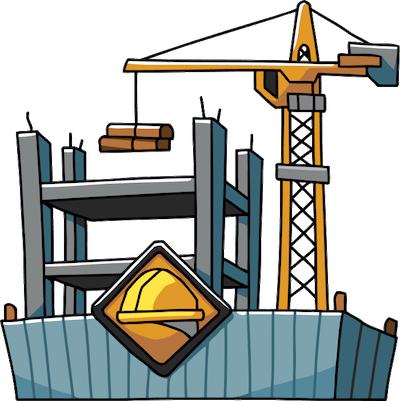

# Build Tooling Pipeline

---

## Goals
This project should help you to:
* Gain a better understanding of the build pipeline from start to finish.
* Understand the importance of each step
* Know how to set up tools for each step
* Be able to debug problems with project pipelines

## Tools to setup in this project
* Docker
  * Dockerfile
  * Docker-compose.yml
  * Persistent Volume
* ESLint
* Stylelint
* Test Suite
  * Your choice
* Webpack
  * This project should have at least 2 TS files using the [import/export][import-export] syntax
* CodeClimate
  * Should fail a build if it doesn't pass checks
* CircleCI
  * Should fail a build if it doesn't pass checks
* Rollbar
  * Errors should be reported here
  * Deploys should be reported here 
* GitHub Actions
  * Should build the Docker container and push it to Docker Hub or GitHub Packages
* Slack
  * Choose which things should be reported back to Slack

## Details
`1/21/2022` - Presentation and possibly start working

`2/4/2022` - Present current state of things & discussion

`2/18/2022` - Present finished project & discussion

[import-export]: https://developer.mozilla.org/en-US/docs/Web/JavaScript/Reference/Statements/import
