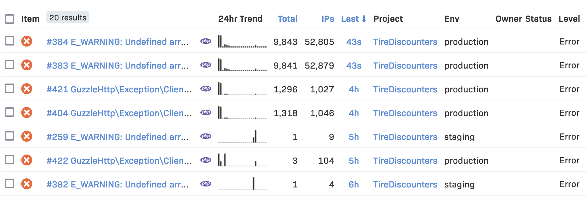
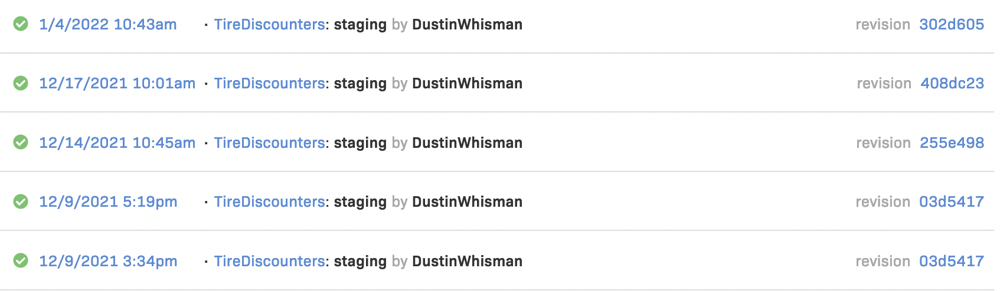

# Logging

## Rollbar
We use Rollbar for 2 main purposes

### Error Logging

### Monitoring Deploys

## Requirements
  * Your code should send error/warning messages to Rollbar with meaningful data.
  * Rollbar should be notified whenever you deploy a new version
  