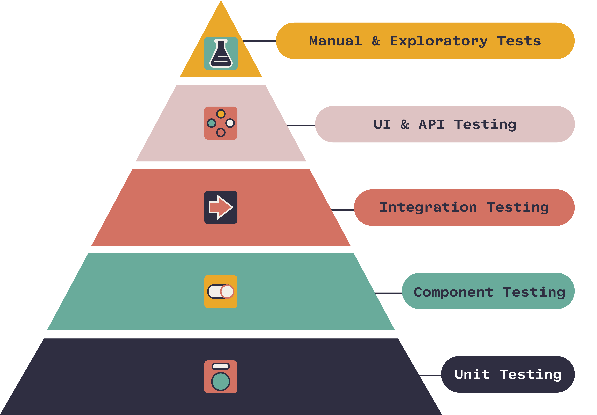

# Testing


## JS Testing

### Jest

### Mocha


## What Are We Testing



<p style="font-size: 1rem">source: <a href="https://www.onpathtesting.com/blog/qa-testers-what-is-the-agile-testing-pyramid">https://www.onpathtesting.com/blog/qa-testers-what-is-the-agile-testing-pyramid</a></p>


## Requirements

It should run at least one test in one of these frameworks. 

It can be as simple as 
```
it('runs tests', () => {
  expect(true).toBe(true);
}
```
